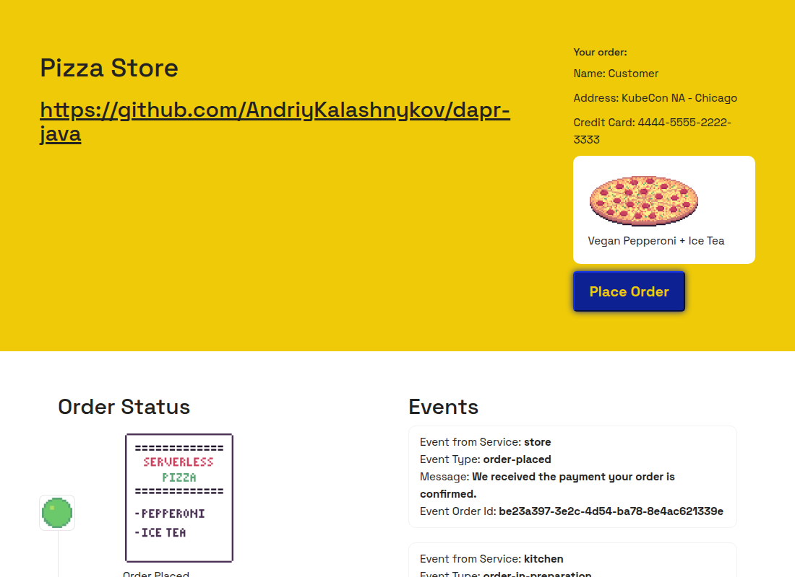
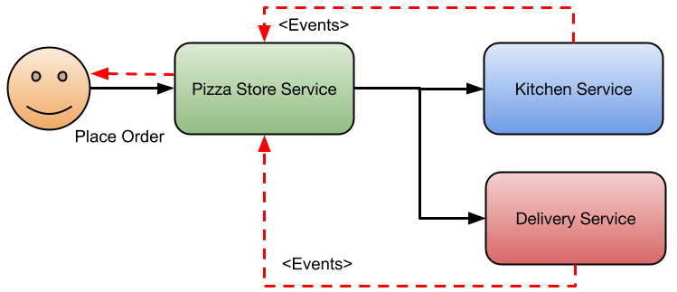
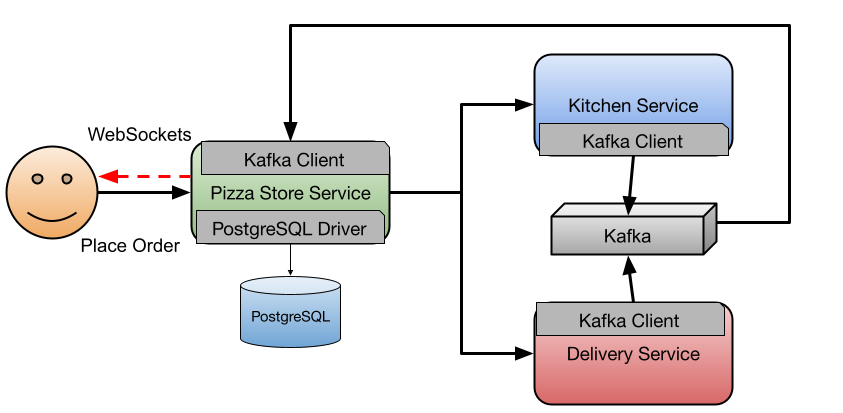
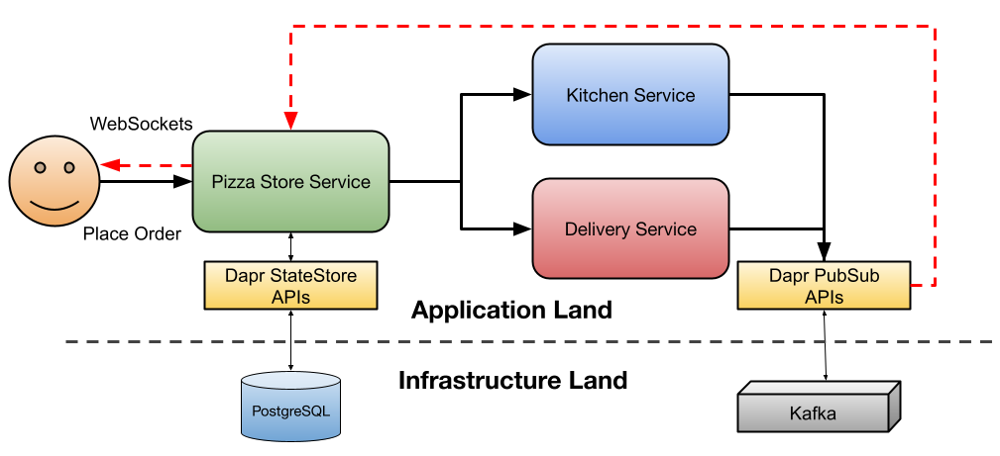
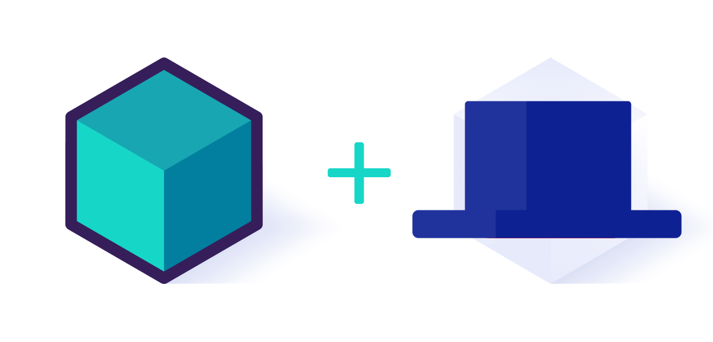

[](https://github.com/AndriyKalashnykov/dapr-java/actions/workflows/ci.yml)
[](https://hits.sh/github.com/AndriyKalashnykov/dapr-java/)
[](https://opensource.org/licenses/Apache-2.0)
[](https://app.renovatebot.com/dashboard#github/AndriyKalashnykov/dapr-java)

# Cloud-Native Pizza Store

Reference implementation of a three-service Java microservice platform on [Dapr](https://dapr.io), demonstrating PubSub, State Store, and Service Invocation building blocks with [Spring Boot 4](https://spring.io/projects/spring-boot) and [Testcontainers](https://testcontainers.com). Deployable on any Kubernetes cluster or runnable locally with Docker.

[Quarkus implementation available here (Thanks to @mcruzdev1!)](https://github.com/mcruzdev/pizza-quarkus)



## Tech Stack

| Component | Technology | Rationale |
|-----------|-----------|-----------|
| Language | Java 21 LTS | Current LTS with virtual threads and pattern matching |
| Framework | Spring Boot 4.0.5 | Current GA; aligns with Spring Cloud 2025 |
| Runtime sidecar | Dapr 1.17.2 | Provides PubSub, State Store, Service Invocation APIs |
| Dapr SDK | `dapr-spring-boot-4-starter` 1.17.2 | Matches Dapr runtime version |
| HTTP server | Embedded Tomcat 11.0.21 | Pinned in `dependencyManagement` to address CVEs |
| JSON | Jackson 3.1.2 | Pinned to address CVE-reported 2.x transitive dependencies |
| gRPC | gRPC 1.80.0 | Pinned to address CVEs in older Spring-Boot-managed version |
| Build | Maven 3.9.14 | Latest 3.9.x; Maven 4.0 upgrade tracked in backlog |
| Test containers | Testcontainers 2.x + `testcontainers-dapr` 1.17.2 | Runs containerized Dapr sidecars during tests |
| Code quality | Checkstyle + google-java-format 1.35.0 + Trivy + gitleaks | Composite `make static-check` gate |
| Coverage | JaCoCo (80% min, enforced) | Enforced by `make coverage-check` |
| Version manager | [mise](https://mise.jdx.dev/) | Pins Java/Maven/Node via `.mise.toml` |
| CI | GitHub Actions | Workflow at `.github/workflows/ci.yml` |

## Quick Start

```bash
make deps          # install build dependencies via mise (reads .mise.toml)
make build         # build project (skips tests)
make test          # run unit tests (requires Docker)
make run           # start the application
# Open http://localhost:8080
```

## Prerequisites

| Tool | Version | Purpose |
|------|---------|---------|
| [Git](https://git-scm.com/) | latest | Source control |
| [GNU Make](https://www.gnu.org/software/make/) | 3.81+ | Build orchestration |
| [mise](https://mise.jdx.dev/) | latest | Installs Java/Maven/Node from `.mise.toml` (auto-bootstrapped by `make deps`) |
| [JDK](https://adoptium.net/) | 21+ | Java runtime and compiler (installed by mise) |
| [Maven](https://maven.apache.org/) | 3.9.14 | Build and dependency management (installed by mise) |
| [Docker](https://www.docker.com/) | latest | Integration tests via Testcontainers |

Install all required dependencies:

```bash
make deps
```

Verify installed tools:

```bash
make env-check
```

## Architecture

The Pizza Store application simulates placing a Pizza Order that is processed by different services. The Pizza Store Service serves as the frontend and backend to place orders. Orders are sent to the Kitchen Service for preparation and once ready, the Delivery Service takes the order to your door.



These services need a persistent store (PostgreSQL) and a message broker (Kafka) for event-driven communication.



Adding [Dapr](https://dapr.io) decouples services from infrastructure. Dapr provides [building block APIs](https://docs.dapr.io/concepts/building-blocks-concept/) (StateStore, PubSub) so developers don't need to choose or configure specific drivers and clients. Infrastructure teams can swap components without impacting application code.



## Testing

Tests use [Testcontainers](https://testcontainers.com) with [`io.dapr:testcontainers-dapr`](https://central.sonatype.com/artifact/io.dapr/testcontainers-dapr) to automatically start Dapr sidecars and placement services. Integration tests run outside of Kubernetes without any manual Dapr setup — only Docker is required.



Two test layers are exposed:

| Layer | Command | Scope | Runtime |
|-------|---------|-------|---------|
| Unit | `make test` | Surefire runs `**/*Test.java` against in-memory PubSub Dapr sidecars | Seconds |
| Integration | `make integration-test` | Failsafe runs `**/*IT.java` against real dependencies (no `*IT.java` tests currently exist — layer reserved for future end-to-end scenarios) | Tens of seconds |

Once the service is up, events from the Kitchen and Delivery services can be simulated by posting CloudEvents to the `/events` endpoint. Using [`httpie`](https://httpie.io/):

```bash
http :8080/events Content-Type:application/cloudevents+json < pizza-store/event-in-prep.json
```

## Kubernetes Deployment

### Create a Cluster

If no Kubernetes cluster is available, [install KinD](https://kind.sigs.k8s.io/docs/user/quick-start/) and create a local cluster:

```bash
kind create cluster
```

### Install Dapr

```bash
helm repo add dapr https://dapr.github.io/helm-charts/
helm repo update
helm upgrade --install dapr dapr/dapr \
  --version=1.17.4 \
  --namespace dapr-system \
  --create-namespace \
  --wait
```

### Install Infrastructure

Kafka for messaging between services:

```bash
helm install kafka oci://registry-1.docker.io/bitnamicharts/kafka --version 22.1.5 \
  --set "provisioning.topics[0].name=events-topic" \
  --set "provisioning.topics[0].partitions=1" \
  --set "persistence.size=1Gi"
```

PostgreSQL for persistent storage:

```bash
kubectl apply -f k8s/pizza-init-sql-cm.yaml

helm install postgresql oci://registry-1.docker.io/bitnamicharts/postgresql --version 12.5.7 \
  --set "image.debug=true" \
  --set "primary.initdb.user=postgres" \
  --set "primary.initdb.password=postgres" \
  --set "primary.initdb.scriptsConfigMap=pizza-init-sql" \
  --set "global.postgresql.auth.postgresPassword=postgres" \
  --set "primary.persistence.size=1Gi"
```

> **Note:** Bitnami chart images moved behind a paywall in mid-2025. If `bitnamicharts` pulls fail, substitute `bitnamilegacysecure` or migrate to vendor-neutral charts. Chart versions above are the last free-tier releases verified with this project.

### Deploy the Application

```bash
kubectl apply -f k8s/
```

Access the application via port-forward:

```bash
kubectl port-forward svc/pizza-store 8080:80
```

Open [`http://localhost:8080`](http://localhost:8080).

All three Deployments apply `securityContext` with `runAsNonRoot`, `readOnlyRootFilesystem`, dropped Linux capabilities, and a `tmpfs` volume for writable paths.

## Available Make Targets

Run `make help` to see all available targets.

### Build & Run

| Target | Description |
|--------|-------------|
| `make build` | Build project (skips tests) |
| `make test` | Run unit tests (Surefire, `**/*Test.java`) |
| `make integration-test` | Run integration tests (Failsafe, `**/*IT.java`, Testcontainers) |
| `make clean` | Remove build artifacts |
| `make run` | Run the application |

### Code Quality

| Target | Description |
|--------|-------------|
| `make static-check` | Composite gate: `format-check` + `lint` + `trivy-fs` + `trivy-config` + `secrets` |
| `make lint` | Run Checkstyle static analysis |
| `make format` | Auto-format Java source (google-java-format) |
| `make format-check` | Verify source formatting without modifying files |
| `make trivy-fs` | Scan filesystem for HIGH/CRITICAL vulns, secrets, misconfigs |
| `make trivy-config` | Scan `k8s/` and `k8s-dapr-shared/` manifests for KSV-* findings |
| `make secrets` | Scan git history and tree for leaked secrets (gitleaks) |
| `make deps-prune` | Analyze Maven dependencies (advisory) |
| `make deps-prune-check` | Fail if unused declared Maven dependencies exist |
| `make cve-check` | OWASP dependency vulnerability scan |
| `make coverage-generate` | Generate JaCoCo coverage report |
| `make coverage-check` | Verify coverage meets minimum threshold (78% current, 80% target) |
| `make coverage-open` | Open coverage report in browser |

### CI

| Target | Description |
|--------|-------------|
| `make ci` | Full CI pipeline: `clean deps static-check test integration-test build cve-check coverage-check` |
| `make ci-run` | Run GitHub Actions workflow locally via [act](https://github.com/nektos/act) |

### Dependencies & Tools

| Target | Description |
|--------|-------------|
| `make deps` | Install build dependencies via mise |
| `make deps-check` | Verify build dependencies are installed |
| `make deps-maven` | Install Maven from Apache archives (CI fallback) |
| `make deps-act` | Install act |
| `make deps-trivy` | Install Trivy |
| `make deps-gitleaks` | Install gitleaks |
| `make deps-gjf` | Download google-java-format jar |
| `make env-check` | Show installed tool versions |

### Utilities

| Target | Description |
|--------|-------------|
| `make print-deps-updates` | Print project dependency updates |
| `make update-deps` | Update dependencies to latest releases |
| `make renovate-validate` | Validate Renovate configuration |
| `make release VERSION=x.y.z` | Create a semver release tag |

## CI/CD

GitHub Actions runs on every push to `main`, tags `v*`, and pull requests.

| Job | Triggers | Depends on | Steps |
|-----|----------|-----------|-------|
| **static-check** | push, PR, tags | — | `make static-check` (format-check, Checkstyle, trivy-fs, trivy-config, gitleaks) |
| **build** | push, PR, tags | `static-check` | `make build`; uploads service JAR artifacts on tag pushes only |
| **test** | push, PR, tags | `static-check` | `make coverage-generate` + `make coverage-check`; uploads JaCoCo report |
| **cve-check** | push to `main` or tag | `build`, `test` | `make cve-check` (OWASP dependency-check); uploads HTML report |
| **ci-pass** | always | all above | Gate job that fails if any needed job failed |

### Required Secrets and Variables

| Name | Type | Used by | How to obtain |
|------|------|---------|---------------|
| `NVD_API_KEY` | Secret (optional) | `cve-check` job | Free API key from [NIST NVD](https://nvd.nist.gov/developers/request-an-api-key) — recommended to avoid NVD rate-limiting |

Set secrets via **Settings > Secrets and variables > Actions > New repository secret**.

[Renovate](https://docs.renovatebot.com/) keeps dependencies up to date with platform automerge enabled.

## Resources and References

- [Dapr For Java Developers](https://dzone.com/articles/dapr-for-java-developers)
- [Platform Engineering on Kubernetes Book](http://mng.bz/jjKP?ref=salaboy.com)
- [Cloud Native Local Development with Dapr and Testcontainers](https://www.diagrid.io/blog/cloud-native-local-development)

## Contributing

Contributions welcome — [open an issue](https://github.com/AndriyKalashnykov/dapr-java/issues) or submit a pull request.
