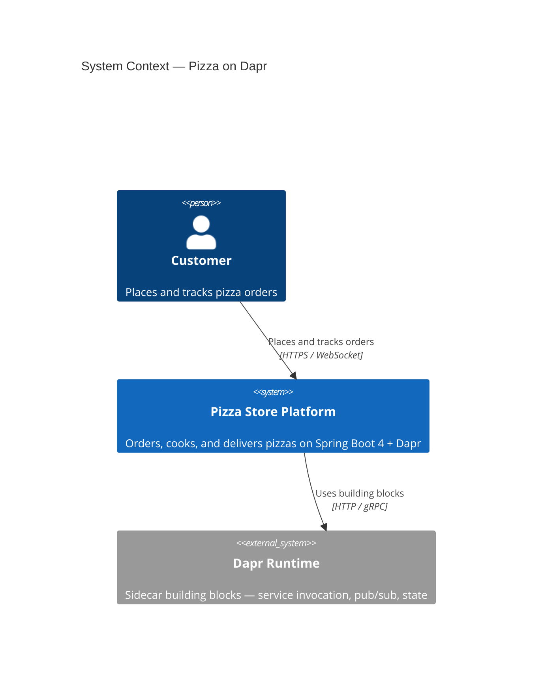
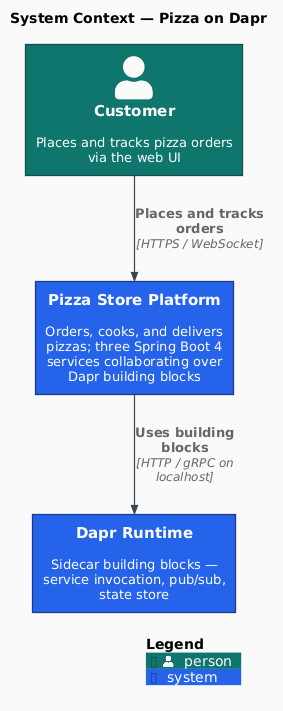
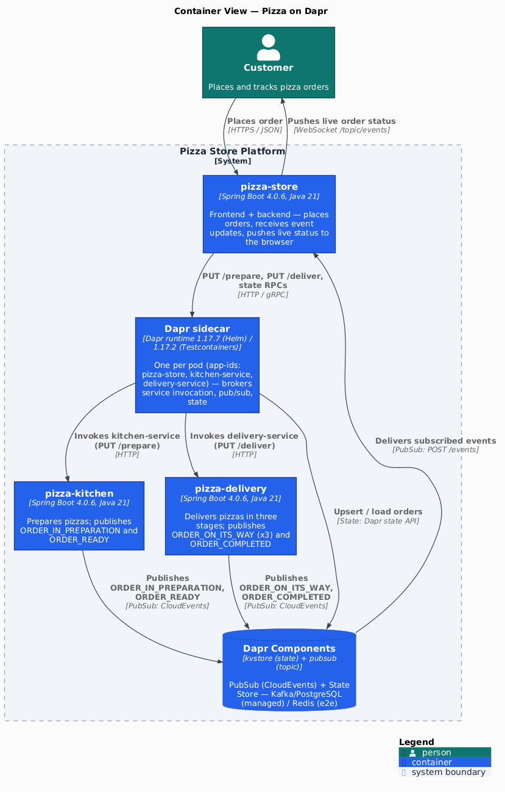
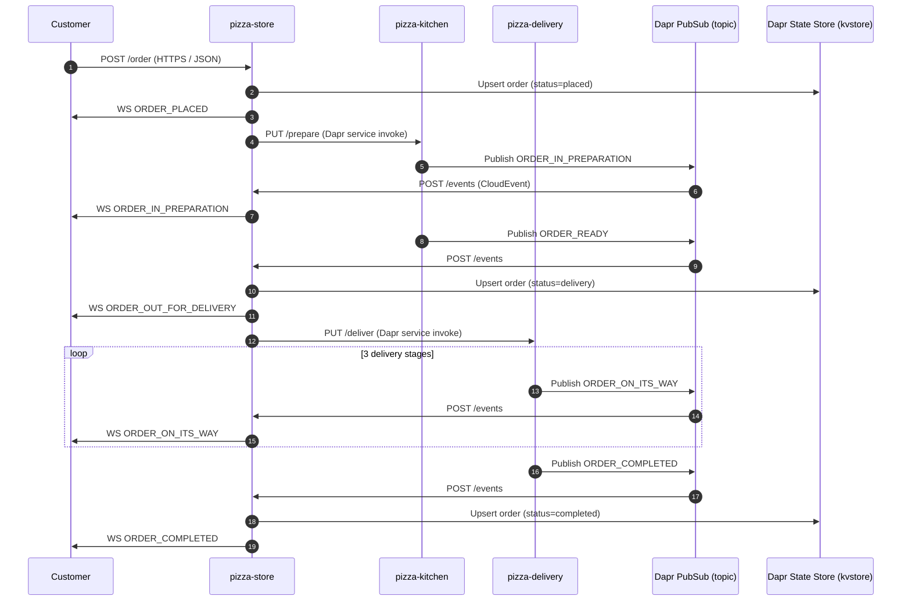
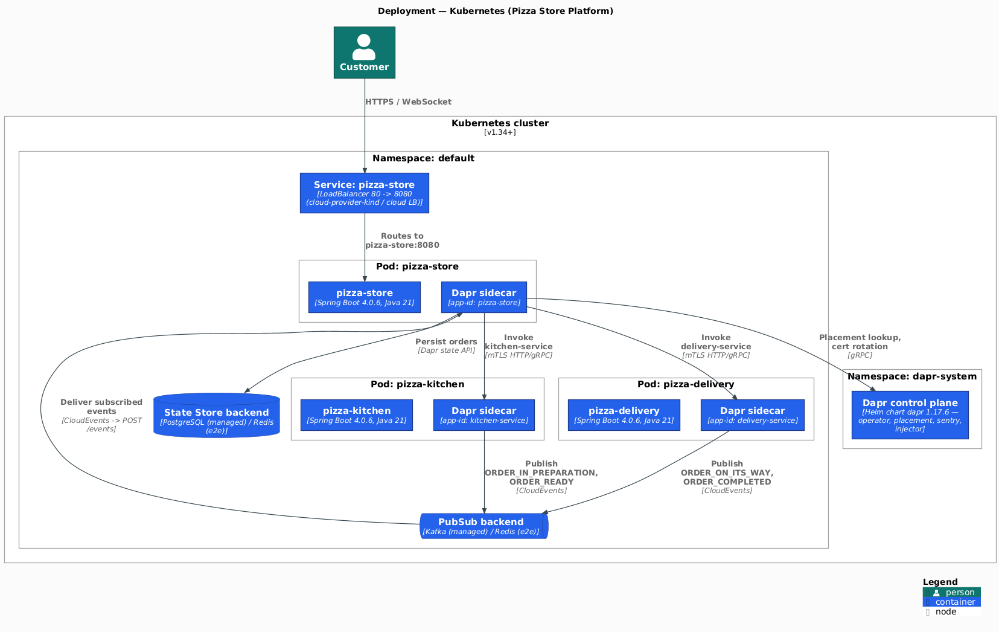
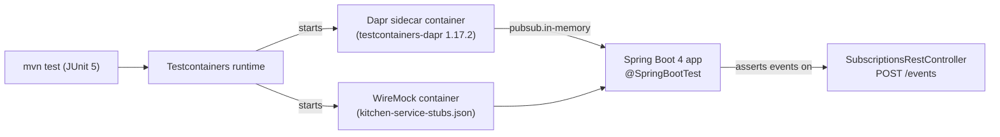

[](https://github.com/AndriyKalashnykov/dapr-java/actions/workflows/ci.yml)
[](https://hits.sh/github.com/AndriyKalashnykov/dapr-java/)
[](https://opensource.org/licenses/Apache-2.0)
[](https://app.renovatebot.com/dashboard#github/AndriyKalashnykov/dapr-java)

# Pizza on Dapr — Spring Boot 4 Microservices Reference

Reference implementation of a three-service Java microservice platform on [Dapr](https://dapr.io), demonstrating PubSub, State Store, and Service Invocation building blocks with [Spring Boot 4](https://spring.io/projects/spring-boot) and [Testcontainers](https://testcontainers.com). Deployable on any Kubernetes cluster or run locally on KinD via `make kind-up`; integration tests use Testcontainers (no Dapr install required).




## Tech Stack

| Component | Technology | Rationale |
|-----------|-----------|-----------|
| Language | Java 21 LTS | Current LTS with virtual threads and pattern matching |
| Framework | Spring Boot 4.0.6 | Current GA; provides embedded Tomcat, auto-configuration, and Actuator |
| Runtime sidecar | Dapr 1.17.5 (Helm) / 1.17.2 (Testcontainers) | Provides PubSub, State Store, Service Invocation APIs. Helm chart on KinD/prod runs ahead of the Java SDK; Testcontainers pins to the SDK version |
| Dapr SDK | `dapr-spring-boot-4-starter` 1.17.2 | Latest stable on Maven Central; 1.17.3 is RC-only |
| HTTP server | Embedded Tomcat 11.0.21 | Pinned in `dependencyManagement` to address CVEs |
| JSON | Jackson 3.1.2 | Pinned to address CVE-reported 2.x transitive dependencies |
| gRPC | gRPC 1.80.0 | Pinned to address CVEs in older Spring-Boot-managed version |
| Build | Maven 3.9.15 | Latest 3.9.x; Maven 4.0 upgrade tracked in backlog |
| Testcontainers | Testcontainers 2.x + `testcontainers-dapr` 1.17.2 | Runs containerized Dapr sidecars during tests |
| Code quality | Checkstyle + google-java-format 1.35.0 + Trivy + gitleaks | Composite `make static-check` gate |
| Diagram lint | PlantUML 1.2026.2 (`make diagrams-check`) + mermaid-cli 11.12.0 (`make mermaid-lint`) | Wired into `make static-check` |
| Manifest validation | kubeconform 0.7.0 (`make k8s-validate`, vendored OpenAPI — no cluster needed) | Validates both `k8s/` and `k8s-dapr-shared/` on every push |
| Coverage | JaCoCo (80% min, enforced) | Enforced by `make coverage-check` |
| Version manager | [mise](https://mise.jdx.dev/) | Pins Java/Maven/Node via `.mise.toml` |
| CI | GitHub Actions | Workflow at `.github/workflows/ci.yml` |

## Quick Start

```bash
make deps          # install build dependencies via mise (reads .mise.toml)
make build         # build project (skips tests)
make test          # run unit tests (requires Docker)
make run           # start pizza-store standalone
# Open http://localhost:8080
```

`make run` boots `pizza-store` only — the UI loads, but order placement requires the full three-service stack with Dapr sidecars. Use `make kind-up` (see [Kubernetes Deployment](#kubernetes-deployment)) to bring everything up locally.

## Prerequisites

| Tool | Version | Purpose |
|------|---------|---------|
| [Git](https://git-scm.com/) | latest | Source control |
| [GNU Make](https://www.gnu.org/software/make/) | 3.81+ | Build orchestration |
| [mise](https://mise.jdx.dev/) | latest | Installs Java/Maven/Node from `.mise.toml` (auto-bootstrapped by `make deps`) |
| [JDK](https://adoptium.net/) | 21+ | Java runtime and compiler (installed by mise) |
| [Maven](https://maven.apache.org/) | 3.9.15 | Build and dependency management (installed by mise) |
| [Docker](https://www.docker.com/) | latest | Integration tests via Testcontainers |

Install all required dependencies:

```bash
make deps
```

Verify installed tools:

```bash
make env-check
```

## Architecture

The Pizza Store application simulates placing a Pizza Order that is processed by three Spring Boot 4 services communicating over Dapr building blocks. The Pizza Store Service serves as the frontend and backend to place orders; orders are sent to the Kitchen Service for preparation and once ready, the Delivery Service takes the order to the customer. [Dapr](https://dapr.io) decouples the services from infrastructure — [building block APIs](https://docs.dapr.io/concepts/building-blocks-concept/) (State Store, PubSub, Service Invocation) let infrastructure teams swap PostgreSQL/Kafka (prod) for Redis (e2e) without touching application code.

### Context View



A customer interacts with the Pizza Store Platform over HTTPS / WebSocket; the platform delegates service invocation, pub/sub, and state persistence to its co-deployed Dapr Runtime (Helm-installed control plane plus per-pod sidecars). Source: [`docs/diagrams/c4-context.puml`](docs/diagrams/c4-context.puml).

### Container View



- **pizza-store** — frontend + backend; places orders via the Dapr state API (`kvstore`), invokes `kitchen-service`/`delivery-service` via Dapr service invocation, subscribes to `pubsub/topic` CloudEvents on `POST /events`, and pushes live status to the browser via WebSocket `/topic/events`.
- **pizza-kitchen** — receives `PUT /prepare` through its Dapr sidecar; simulates cooking and publishes `ORDER_IN_PREPARATION` then `ORDER_READY` to the shared `pubsub` component on topic `topic`.
- **pizza-delivery** — receives `PUT /deliver` through its sidecar; emits `ORDER_ON_ITS_WAY` (three times) and `ORDER_COMPLETED` as three-second stages advance.
- **Dapr sidecar** (1.17.5, one per pod) — brokers all cross-service traffic; apps never address each other directly.
- **State Store** (`kvstore`) — PostgreSQL in production, Redis in e2e. The store applies `ORDER_READY` → `Status.delivery` and `ORDER_COMPLETED` → `Status.completed` as upserts to the same order id.
- **PubSub** (`pubsub`, topic `topic`) — Kafka in production, Redis in e2e.

### Order Flow



### Deployment View



- Three pods in the `default` namespace, one per service (`pizza-store`, `pizza-kitchen`, `pizza-delivery`), each running a single replica with matching `dapr.io/app-id` annotations (`pizza-store`, `kitchen-service`, `delivery-service`).
- Each pod co-locates the Spring Boot app container with a Dapr sidecar injected via the `dapr.io/enabled` annotation. Cross-pod service invocation flows app → local sidecar → remote sidecar → remote app over mTLS HTTP/gRPC; apps never address each other directly.
- `pizza-store` is exposed through a `Service` of type `LoadBalancer`. On KinD that IP is provisioned by [cloud-provider-kind](https://github.com/kubernetes-sigs/cloud-provider-kind) (host-side controller, no in-cluster MetalLB); in production the cloud LB controller fills the same role. Service port 80 bridges to container port 8080.
- The Dapr control plane (`dapr-operator`, `placement`, `sentry`, `injector`) runs in the `dapr-system` namespace via the official Helm chart (1.17.5).
- PubSub and State Store components resolve to Redis for e2e (`k8s/components-e2e.yaml`) and to Kafka + PostgreSQL in production.

Source files live in [`docs/diagrams/`](docs/diagrams/); regenerate the PNGs with `make diagrams`.

## API

The three services expose the following HTTP surface. Cross-service calls go through Dapr service invocation (`dapr-app-id` header); the WebSocket topic is broadcast to browsers by `pizza-store`.

| Method | Path | Service | Purpose |
|--------|------|---------|---------|
| `POST` | `/order` | pizza-store | Place a new order; persists to the `kvstore` State Store and triggers downstream service invocation |
| `GET` | `/order` | pizza-store | List orders held in the State Store |
| `POST` | `/events` | pizza-store | CloudEvent subscriber (`Content-Type: application/cloudevents+json`); routes `ORDER_*` events to State Store updates and WebSocket broadcasts |
| `PUT` | `/prepare` | pizza-kitchen | Receive an order via Dapr invoke; publishes `ORDER_IN_PREPARATION` and `ORDER_READY` to the `pubsub` component |
| `PUT` | `/deliver` | pizza-delivery | Receive an order via Dapr invoke; publishes `ORDER_ON_ITS_WAY` (×3) and `ORDER_COMPLETED` |
| `WS` | `/ws` → `/topic/events` | pizza-store | STOMP broker; clients subscribe to `/topic/events` for live order status |
| `GET` | `/actuator/health` | all three | Spring Boot Actuator liveness/readiness probe |

CloudEvents can be replayed locally against a running pizza-store using [`httpie`](https://httpie.io/):

```bash
http :8080/events Content-Type:application/cloudevents+json < pizza-store/event-in-prep.json
```

## Build & Package

The build pipeline produces three artefact tiers, each gated by a separate `make` target:

| Stage | Command | Output | Notes |
|-------|---------|--------|-------|
| Compile + JAR | `make build` | `pizza-store/target/*.jar`, `pizza-kitchen/target/*.jar`, `pizza-delivery/target/*.jar` | Standard Maven `install -Dmaven.test.skip=true` |
| OCI image | `make image-build` | `pizza-store:e2e`, `pizza-kitchen:e2e`, `pizza-delivery:e2e` (local Docker daemon) | Built via `mvn spring-boot:build-image` (Paketo CNB buildpacks); no `Dockerfile` |
| Image scan | `make image-scan` | Pass / fail (HIGH/CRITICAL fixed-only) | Trivy `--ignore-unfixed --exit-code 1`; closes the Paketo base-layer CVE blind spot that `trivy-fs` and `cve-check` cannot see |

For tag-gated GHCR publication see [CI/CD](#cicd) — the `docker` job builds, scans, smoke-tests (Spring Boot boot marker), pushes to `ghcr.io/<owner>/<repo>/pizza-*:<version>` and `:latest`, and signs every digest with [cosign keyless OIDC](https://docs.sigstore.dev/cosign/keyless/) (Sigstore Fulcio).

### Testing

Tests use [Testcontainers](https://testcontainers.com) with [`io.dapr:testcontainers-dapr`](https://central.sonatype.com/artifact/io.dapr/testcontainers-dapr) to start Dapr sidecars and placement services. Integration tests run outside Kubernetes without any manual Dapr setup — only Docker is required.



Three test layers are exposed:

| Layer | Command | Scope | Runtime |
|-------|---------|-------|---------|
| Unit | `make test` | Surefire runs `**/*Test.java` against in-memory PubSub Dapr sidecars | ~30 s |
| Integration | `make integration-test` | Failsafe runs `**/*IT.java`: `PizzaStoreStateStoreIT` (real `kvstore` round-trip), `KitchenInvocationIT` / `DeliveryInvocationIT` (service-invocation contract via WireMock), `WebSocketBroadcastIT` (STOMP broadcast of `ORDER_PLACED`) | ~1 min |
| E2E | `make e2e` | KinD + cloud-provider-kind + Dapr Helm + `e2e/e2e-test.sh` asserts the full `store → kitchen → store → delivery → store` lifecycle reaches `Status.completed` through the LoadBalancer | ~2 min |

## Kubernetes Deployment

### Local KinD (recommended)

The fastest path from a clean checkout to a running, end-to-end-tested cluster:

```bash
make kind-up          # create KinD cluster, start cloud-provider-kind, install Dapr via Helm, build images, apply manifests, wait for rollout
make e2e              # run e2e/e2e-test.sh against the LoadBalancer IP
make kind-down        # tear it all down
```

`make kind-up` chains `kind-create` → `image-build` → `kind-deploy`; individual targets remain available for debugging (see [Make Targets](#available-make-targets)). The cluster uses [cloud-provider-kind](https://github.com/kubernetes-sigs/cloud-provider-kind) for LoadBalancer IPs (a host-side controller on the `kind` Docker network) and Redis for both PubSub and State Store via `k8s/components-e2e.yaml` — hermetic, no Kafka or PostgreSQL dependencies.

### Bring your own cluster

If a production-shaped cluster is already available, install the runtime components manually:

```bash
# Dapr control plane
helm repo add dapr https://dapr.github.io/helm-charts/
helm repo update
helm upgrade --install dapr dapr/dapr \
  --version=1.17.5 \
  --namespace dapr-system \
  --create-namespace \
  --wait
```

```bash
# Kafka (PubSub backend in production)
helm install kafka oci://registry-1.docker.io/bitnamicharts/kafka --version 22.1.5 \
  --set "provisioning.topics[0].name=events-topic" \
  --set "provisioning.topics[0].partitions=1" \
  --set "persistence.size=1Gi"
```

```bash
# PostgreSQL (State Store backend in production)
kubectl apply -f k8s/pizza-init-sql-cm.yaml

helm install postgresql oci://registry-1.docker.io/bitnamicharts/postgresql --version 12.5.7 \
  --set "image.debug=true" \
  --set "primary.initdb.user=postgres" \
  --set "primary.initdb.password=postgres" \
  --set "primary.initdb.scriptsConfigMap=pizza-init-sql" \
  --set "global.postgresql.auth.postgresPassword=postgres" \
  --set "primary.persistence.size=1Gi"
```

> **Note:** Bitnami chart images moved behind a paywall in mid-2025. If `bitnamicharts` pulls fail, substitute `bitnamilegacysecure` or migrate to vendor-neutral charts. Chart versions above are the last free-tier releases verified with this project.

```bash
# Application manifests
kubectl apply -f k8s/
```

Access the application:

```bash
kubectl port-forward svc/pizza-store 8080:80
```

Open [`http://localhost:8080`](http://localhost:8080).

All three Deployments apply `securityContext` with `runAsNonRoot`, `readOnlyRootFilesystem`, dropped Linux capabilities, and a `tmpfs` volume for writable paths.

## Available Make Targets

Run `make help` to see all available targets.

### Build & Run

| Target | Description |
|--------|-------------|
| `make build` | Build project (skips tests) |
| `make test` | Run unit tests (Surefire, `**/*Test.java`) |
| `make integration-test` | Run integration tests (Failsafe, `**/*IT.java`, Testcontainers) |
| `make clean` | Remove build artifacts |
| `make run` | Run the application |

### Code Quality

| Target | Description |
|--------|-------------|
| `make static-check` | Composite gate: `format-check` + `lint` + `trivy-fs` + `trivy-config` + `secrets` + `diagrams-check` + `mermaid-lint` + `k8s-validate` |
| `make k8s-validate` | Validate `k8s/` + `k8s-dapr-shared/` manifests against vendored OpenAPI via kubeconform (no cluster needed) |
| `make lint` | Run Checkstyle static analysis |
| `make format` | Auto-format Java source (google-java-format) |
| `make format-check` | Verify source formatting without modifying files |
| `make trivy-fs` | Scan filesystem for HIGH/CRITICAL vulns, secrets, misconfigs |
| `make trivy-config` | Scan `k8s/` and `k8s-dapr-shared/` manifests for KSV-* findings |
| `make secrets` | Scan git history and tree for leaked secrets (gitleaks) |
| `make deps-prune` | Analyze Maven dependencies (advisory) |
| `make deps-prune-check` | Fail if unused declared Maven dependencies exist |
| `make cve-check` | OWASP dependency vulnerability scan (advisory; bundled into `make pre-release` with a 300 s timeout wrapper) |
| `make image-scan` | Scan built `pizza-*:e2e` OCI images for HIGH/CRITICAL CVEs with fixes (closes Paketo/CNB blind spot that `trivy-fs` and `cve-check` miss) |
| `make coverage-generate` | Generate JaCoCo coverage report (merged surefire + failsafe) |
| `make coverage-check` | Verify merged coverage meets minimum threshold (80%) |
| `make coverage-open` | Open coverage report in browser |

### Diagrams

| Target | Description |
|--------|-------------|
| `make diagrams` | Render PlantUML sources in `docs/diagrams/` to PNG under `docs/diagrams/out/` |
| `make diagrams-clean` | Remove rendered PNGs |
| `make diagrams-check` | Verify committed PNGs are in sync with `.puml` sources (gate in `static-check`) |
| `make mermaid-lint` | Lint Mermaid fenced blocks in markdown via `minlag/mermaid-cli` (gate in `static-check`) |

### Kubernetes

| Target | Description |
|--------|-------------|
| `make kind-up` | Bring the full local stack up: cluster + cloud-provider-kind + Dapr Helm + images + manifests |
| `make kind-down` | Tear the stack down: remove manifests, stop cloud-provider-kind, delete cluster |
| `make e2e` | Run `e2e/e2e-test.sh` against the LoadBalancer IP after `kind-up` |
| `make image-build` | Build all three service images via `spring-boot:build-image` and tag `:e2e` |
| `make kind-create` | (granular) Create KinD cluster + start cloud-provider-kind + install Dapr |
| `make kind-deploy` | (granular) Build + load images, apply manifests, wait for rollout + LB IP |
| `make kind-undeploy` | (granular) Delete application manifests from the cluster |
| `make kind-destroy` | (granular) Stop cloud-provider-kind + delete KinD cluster |

### CI

| Target | Description |
|--------|-------------|
| `make ci` | Local CI pipeline: `clean deps static-check test integration-test build coverage-check` (cve-check is separate — run `make cve-check` before pushing a release tag) |
| `make ci-run` | Run GitHub Actions workflow locally via [act](https://github.com/nektos/act); jobs are serialized with `act --job` |

### Dependencies & Tools

`mise` is the single source of truth for binary tools (Java, Maven, Node, kubectl, helm, kind, act, trivy, gitleaks). `make deps` invokes `mise install` against `.mise.toml` and verifies the resulting shims.

| Target | Description |
|--------|-------------|
| `make deps` | Install build dependencies via mise (reads `.mise.toml`) |
| `make deps-check` | Verify build dependencies are installed |
| `make deps-maven` | Install Maven from Apache archives (CI fallback when mise unavailable) |
| `make deps-gjf` | Download google-java-format jar |
| `make env-check` | Show installed tool versions |

### Utilities

| Target | Description |
|--------|-------------|
| `make print-deps-updates` | Print project dependency updates |
| `make update-deps` | Update dependencies to latest releases |
| `make renovate-validate` | Validate Renovate configuration |
| `make pre-release` | Pre-release gate: `cve-check` (advisory, 300 s timeout) + `image-scan` (strict). Required before `make release` |
| `make release VERSION=x.y.z` | Create a semver release tag (auto-runs `make pre-release`) |

## CI/CD

GitHub Actions runs on push to `main`, tags `v*`, pull requests, a weekly schedule (`cron: 0 6 * * 1`), `workflow_dispatch`, and `workflow_call` (for downstream pipelines that invoke this workflow).

| Job | Triggers | Depends on | Steps |
|-----|----------|-----------|-------|
| **changes** | push, PR, tags | — | `dorny/paths-filter` emits `code` (binary skip-everything-on-docs-only) and `e2e` (heavy KinD job gating) flags consumed by downstream jobs |
| **static-check** | push, PR, tags (`code` flag) | `changes` | `make static-check` (format-check, Checkstyle, trivy-fs, trivy-config, gitleaks, diagrams-check, mermaid-lint, k8s-validate); `fetch-depth: 0` so gitleaks can walk history |
| **build** | push, PR, tags (`code` flag) | `changes`, `static-check` | `make build`; tag-gated artifact upload of `pizza-*/target/*.jar` |
| **test** | push, PR, tags (`code` flag) | `changes`, `static-check` | `make test` (Surefire unit tests only — fast feedback) |
| **integration-test** | push, PR, tags (`code` flag) | `changes`, `static-check` | `make coverage-generate` + `make coverage-check`; runs surefire + failsafe + merged-coverage gate; uploads JaCoCo report |
| **cve-check** | tag push, weekly cron (Mon 06:00 UTC), `workflow_dispatch` | `static-check` | `make cve-check` (OWASP dependency-check), NVD cache, HTML report upload; `continue-on-error` until upstream NVD deserializer fix |
| **e2e** | push to `main`/tag, PR label `run-e2e` or `e2e` flag, `workflow_dispatch` | `changes`, `build`, `test` | `jdx/mise-action` installs kind/kubectl/helm/trivy/gitleaks/kubeconform/websocat via `mise`, then `make e2e` (now includes K1.5 route-readiness poll + WebSocket broadcast assertion via `websocat`); followed by an OWASP ZAP baseline DAST scan against the LB-exposed pizza-store. Collects pod logs + cluster events on failure |
| **docker** | tag push only | `static-check`, `build`, `test`, `integration-test`, `cve-check`, `e2e` | Per-service-per-arch matrix (6 runners total: `{pizza-store, pizza-kitchen, pizza-delivery} × {amd64, arm64}`; arm64 runs on `ubuntu-24.04-arm`). GATE 1+2: `make image-scan` builds via `spring-boot:build-image` (Paketo CNB, native arch only) and runs `trivy image --severity HIGH,CRITICAL --ignore-unfixed --exit-code 1`. GATE 3: Spring Boot boot-marker smoke test (90 s timeout, fails on missing classes / port-bind / broken auto-config). Each runner pushes its per-arch tag `ghcr.io/<owner>/<repo>/pizza-*:<version>-<arch>` |
| **docker-manifest** | tag push only | `docker` | Per-service matrix. Assembles a multi-arch manifest list with `docker buildx imagetools create` from the per-arch refs, pushes both `:<version>` and `:latest` to GHCR, and signs the manifest digest with [cosign keyless OIDC](https://docs.sigstore.dev/cosign/keyless/) (Sigstore Fulcio, no key material to manage; one signature covers both archs and is recorded in the public Rekor transparency log) |
| **ci-pass** | always | all above | Gate job that fails if any needed job failed or was cancelled (required-status-check target) |

Verify a published multi-arch image's signature locally:

```bash
cosign verify ghcr.io/andriykalashnykov/dapr-java/pizza-store:0.1.2 \
  --certificate-identity-regexp 'https://github.com/AndriyKalashnykov/dapr-java/.github/workflows/ci.yml@refs/tags/v.*' \
  --certificate-oidc-issuer https://token.actions.githubusercontent.com
```

The manifest digest is shared by `linux/amd64` and `linux/arm64` — a single signature covers both. Inspect with `docker buildx imagetools inspect ghcr.io/andriykalashnykov/dapr-java/pizza-store:0.1.2`.

### Required Secrets and Variables

| Name | Type | Used by | How to obtain |
|------|------|---------|---------------|
| `NVD_API_KEY` | Secret (optional) | `cve-check` job | Free API key from [NIST NVD](https://nvd.nist.gov/developers/request-an-api-key) — recommended to avoid NVD rate-limiting |

Set secrets via **Settings > Secrets and variables > Actions > New repository secret**.

[Renovate](https://docs.renovatebot.com/) keeps dependencies up to date with platform automerge enabled.

## Contributing

Contributions welcome — [open an issue](https://github.com/AndriyKalashnykov/dapr-java/issues) or submit a pull request.

## Related Projects

- Quarkus port: [pizza-quarkus](https://github.com/mcruzdev/pizza-quarkus) by @mcruzdev.

## Resources and References

- [Dapr For Java Developers](https://dzone.com/articles/dapr-for-java-developers)
- [Platform Engineering on Kubernetes Book](http://mng.bz/jjKP)
- [Cloud Native Local Development with Dapr and Testcontainers](https://www.diagrid.io/blog/cloud-native-local-development)
